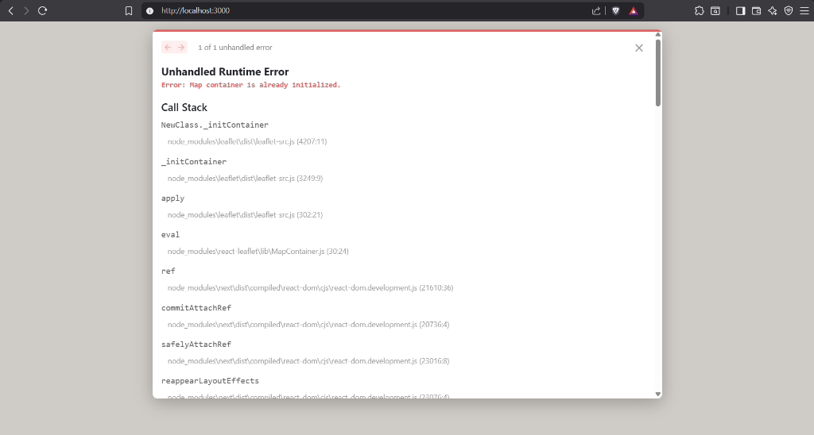
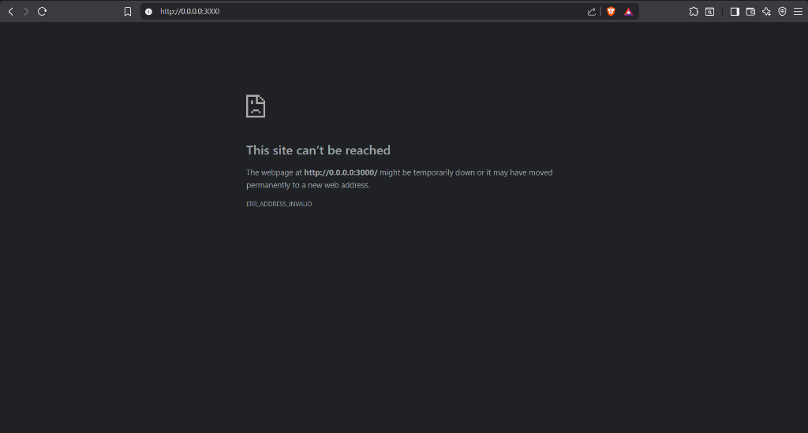

# 🇮🇳 Nagarik — Civic Infrastructure Platform

> AI-powered citizen reporting → strict officer dashboard → automated field dispatch → resolution tracking.

**Nagarik** is an intelligent, scalable civic infrastructure platform designed to bridge the gap between citizens reporting local issues and municipal corporations managing rapid dispatches.

## 🚨 The Problem
Modern municipal corporations are highly bureaucratic and overwhelmed with unstructured data. Citizens submit thousands of complaints daily, many of which are:
- **Duplicates or spam** (e.g., taking pictures of selfies instead of potholes).
- **Lacking actionable location data** (generic addresses instead of precise geospatial coordinates).
- **Unprioritized** (a massive sinkhole gets the same queue position as an overflowing trash can).
This results in massive SLA breaches, wasted fuel for dispatch trucks, and a broken feedback loop with citizens.

## 💡 The Solution
Nagarik forces a strict, AI-validated pipeline that eliminates human sorting:
1. **Zero-Spam Intelligence**: Every citizen photo passes through Google Gemini Vision. If it's not a real issue, the platform rejects it before it even hits the database.
2. **Automated Severity & Routing**: The AI assigns a `Severity Score (1-5)` based on visual hazard levels and strictly forces the issue into its relevant category (e.g., `Water Leakage`, `Road Pothole`).
3. **Preventive Command Center**: Officers are presented with a brutalist, distraction-free dashboard mapping issues via GeoJSON boundaries, with auto-ticking SLA countdown timers. Needs are visually aggregated into geospatial hotspots.

---

## 🏗️ Architecture & Tech Stack


<br/>


The project is built as a highly decoupled microservices architecture functioning in tandem:

| Component | Technology | Description |
|-----------|------------|-------------|
| **Nagarik Mobile App** | React Native (Expo) | A fast, location-aware mobile application allowing citizens to snap photos of municipal issues (potholes, garbage, etc.) and submit them instantly. Uses Base64 transport for cross-network compatibility. |
| **Command Dashboard** | Next.js 14, Tailwind, Leaflet | A robust, web-based municipal dashboard used by city officers. Features real-time Supabase subscriptions updating live maps, statistics, and issue queues seamlessly. |
| **ML/AI Microservice** | Python, FastAPI, Gemini | A dedicated Python microservice handling image inference. Validates if an image contains a legitimate civic issue, estimates severity (1-5), provides bounding context, and filters junk. |
| **Infrastructure** | Supabase (Postgres + PostGIS) | Serves as the central unified backend tracking user authentication, report storage, geospatial coordinates, and real-time syncing. |

---

## 🚀 Quick Start Guide

### 1. Prerequisites
- Node.js (v18+)
- Python 3.10+
- Supabase Account
- Google Gemini API Key

### 2. General Setup
```bash
# Clone the repository
git clone <repo-url>
cd NAGARIK
```

### 3. Supabase Configuration
The application relies on Supabase for both Auth and Database operations.
1. Create a new Supabase project.
2. Run the SQL schema found in `nagarik-app/supabase/migration.sql` inside your Supabase SQL Editor.
3. Keep your `NEXT_PUBLIC_SUPABASE_URL` and `NEXT_PUBLIC_SUPABASE_ANON_KEY` handy.

### 4. ML Microservice (FastAPI)
The central intelligence layer parsing citizen reports.

```bash
cd ml
# Create virtual environment
python -m venv .venv
source .venv/bin/activate  # On Windows: .venv\Scripts\activate

# Install dependencies
pip install -r requirements.txt

# Configure Environment
echo "GEMINI_API_KEY=your_key_here" > .env

# Run server (default: port 8000)
python -m uvicorn main:app --host 0.0.0.0 --port 8000 --reload
```

### 5. Municipal Dashboard (Next.js)
The high-performance tracking and command interface.

```bash
cd website
# Install dependencies
npm install

# Configure Environment (.env.local)
# NEXT_PUBLIC_SUPABASE_URL=...
# NEXT_PUBLIC_SUPABASE_ANON_KEY=...

# Run the development server
npm run dev
```

### 6. Citizen App (React Native/Expo)
The front-line reporting tool.

```bash
cd nagarik-app
# Install dependencies
npm install

# Configure Environment (.env)
# EXPO_PUBLIC_SUPABASE_URL=...
# EXPO_PUBLIC_SUPABASE_ANON_KEY=...
# EXPO_PUBLIC_ML_URL=http://<your-local-ip>:8000

# Start Expo
npx expo start
```

---

## 🛠️ Key Features & Workflows

1. **AI Image Validation**: The Python backend ensures that citizens aren't uploading blank images, selfies, or non-related photos. Gemini strictly categorizes the image into sets like `Road Pothole`, `Water Leakage`, or `Garbage Accumulation`.
2. **Real-time Map Synchronization**: Using Supabase's realtime subscriptions (`postgres_changes`), whenever an issue passes the ML gate and hits the database, the officer's Dashboard Map updates within milliseconds.
3. **Severe Incident Escalation**: Issues flagged with a `Severity of 5` skip standard queues and are immediately pinged as Critical inside the web dashboard.
4. **Resilient Architecture**: All maps are built to avoid DOM recycling conflicts on Fast Refresh, and the mobile application transmits heavily compressed base64 images to bypass standard VPN or Hermes network blocks in constrained environments.

---

## 🔒 Security & Privacy
- **Geospatial Privacy**: User coordinates are bound strictly to the issue and only visible to authenticated municipal officers.
- **Data Integrity**: The ML microservice denies any payloads missing base64 headers or standard latitude/longitude markers.

## 📄 License
Licensed under MIT. Open-sourced for local government implementation.
